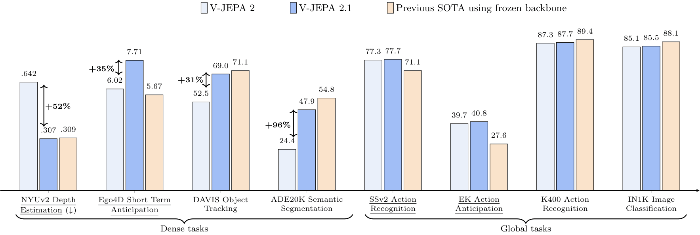
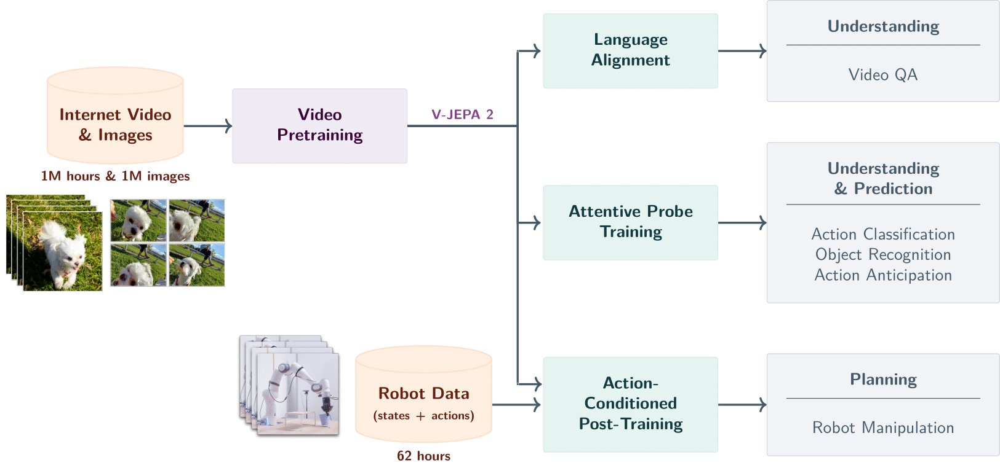
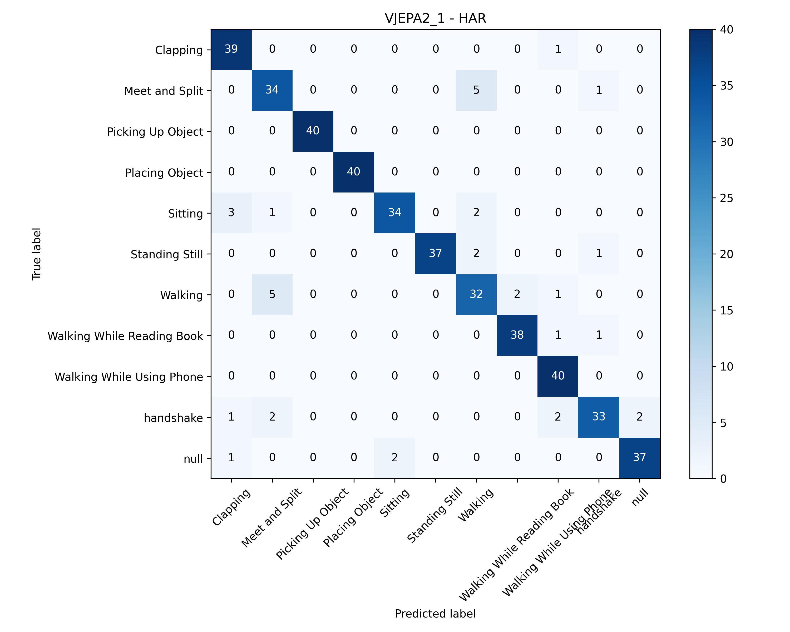
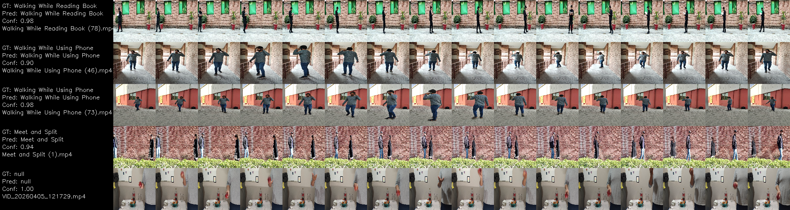

# Human Activity Recognition (HAR) with V-JEPA2 – 11-Class Fine-Tuning



This repository fine-tunes **V-JEPA2**, a state-of-the-art self-supervised video model by Meta AI, for an 11-class Human Activity Recognition (HAR) task. The pipeline includes pre-processing of video clips, fine-tuning of a pre-trained V-JEPA2 backbone, and evaluation with confusion matrix and saved test predictions.

> **Reference:** The original V-JEPA2 documentation is available in [facebookresearch/vjepa2](https://github.com/facebookresearch/vjepa2)

---

## Repository Structure

```
.
├── best.pth                          # Pre-trained V-JEPA2 checkpoint (~345 MB)
├── data_demo/                        # Dataset with train/val/test splits
│   ├── train/                        # Training videos by class
│   ├── val/                          # Validation videos by class
│   ├── test/                         # Test videos by class
│   ├── clapping/                     # Raw class folders (examples)
│   ├── meet_and_split/
│   ├── sitting/
│   ├── still/
│   └── walking/
├── HAR_DL.ipynb                      # Main Jupyter notebook
├── vjepa2.py                         # Fine-tuning script (Colab-exported)
├── vjepa2_1.py                       # Fine-tuning script (argparse CLI)
├── model/                            # Directory for saved models
├── test_predictions_vjepa2.1.csv     # Example predictions
├── vjepa2_1_matrix_confusion.png     # Confusion matrix
├── papers/                           # Research papers and guides
│   ├── V-JEPA 2_ PAPER.pdf
│   ├── V-JEPA 2.1.pdf
│   ├── VJEPA_FineTuning_GuideHAR.md
│   ├── FineTuning_Diferencias_VJEPA2_y_VJEPA21.md
│   └── Resumen_Detallado_VJEPA.md
├── vjepa2/                           # V-JEPA2 source code (do not modify)
└── ...
```



---

## Setup

### 1. Clone the repository

```bash
git clone <this-repo-url>
cd <this-repo>
```

### 2. Install dependencies

```bash
pip install -r vjepa2/requirements.txt
pip install -U git+https://github.com/huggingface/transformers
```

**Note:** `torchcodec>=0.2.1` is required for video decoding but is not in `vjepa2/requirements.txt`. Install it separately:

```bash
pip install torchcodec>=0.2.1
```

### 3. Verify the pre-trained checkpoint

The file `best.pth` should already be present in the repository root. If missing, download it from the original V-JEPA2 repository and place it in the root directory.

### 4. Prepare the data

The `data_demo/` folder already contains the required structure with pre-split `train/`, `val/`, and `test/` directories. The raw activity classes (`clapping`, `meet_and_split`, `sitting`, `still`, `walking`) are also present as examples.

If you need to use your own videos, follow the same directory structure:
```
data_demo/
├── train/
│   ├── class1/
│   ├── class2/
│   └── ...
├── val/
│   ├── class1/
│   └── ...
└── test/
    ├── class1/
    └── ...
```

---

## Fine-Tuning V-JEPA2 for 11-Class HAR

### Option 1: Using `vjepa2_1.py` (Recommended CLI)

The `vjepa2_1.py` script provides a command-line interface with multiple modes:

```bash
# Fine-tune mode (recommended for HAR)
python vjepa2_1.py --mode finetune --checkpoint best.pth --num_classes 11 --epochs 30

# Pre-train mode (for self-supervised learning)
python vjepa2_1.py --mode pretrain --config configs/vjepa2_1_pretrain.yaml

# Extract features mode
python vjepa2_1.py --mode extract --checkpoint best.pth
```

**Key arguments:**
- `--mode`: `pretrain`, `finetune`, or `extract`
- `--checkpoint`: Path to the pre-trained `.pth` file
- `--num_classes`: Number of activity classes (11 for this dataset)
- `--epochs`: Number of training epochs (default: 30)
- `--batch_size`: Adjust based on GPU memory (default: 2)
- `--model_name`: Model variant (default: `vit_large`)
- `--config`: Path to YAML config file for advanced settings

The script adds `vjepa2/` to `sys.path` automatically — run from the repository root.

**Output:** Fine-tuned models are saved to `vjepa2_1_outputs/` by default (configurable with `--output_dir`).

### Option 2: Using `vjepa2.py` (Colab-style script)

The `vjepa2.py` script is a Colab-exported notebook with a `CFG` dictionary at line 99 that controls all parameters:

```bash
python vjepa2.py
```

**Important:** Before running, edit the `CFG` dictionary in the script:
- Change `CFG["data_root"]` from `"HAR_data"` to `"data_demo"`
- Verify `CFG["model_name"]` is set to a valid HuggingFace model (default: `"facebook/vjepa2-vitl-fpc64-256"`)

**Key CFG parameters:**
- `num_epochs`: Number of training epochs (default: 15)
- `batch_size`: Batch size (default: 1, with `accum_steps=8` for effective batch of 8)
- `freeze_backbone`: `True` = only train the classification head (recommended)
- `frames_per_clip`: Number of frames per video clip (default: 32)
- `output_dir`: Output directory (default: `vjepa2_output/`)

**Output:** Models are saved to `vjepa2_output/` by default.

### Option 3: Using the Jupyter Notebook `HAR_DL.ipynb`

Open the notebook in Jupyter Lab or VS Code:

```bash
jupyter lab HAR_DL.ipynb
```

The notebook is fully commented and walks through:
1. **Data Loading & Preprocessing** – reads videos from `data_demo/train`, applies necessary transforms
2. **Model Architecture** – loads `best.pth` and attaches a classification head
3. **Training Configuration** – sets hyperparameters
4. **Training Loop** – runs for a configurable number of epochs with TensorBoard logging
5. **Evaluation & Confusion Matrix** – computes accuracy and generates confusion matrix
6. **Saving Results** – saves the model and predictions

Run the cells sequentially. At the end, a confusion matrix will be displayed and a CSV of test predictions will be saved.

---

## Results

### Confusion Matrix

After fine-tuning, the evaluation generates a confusion matrix showing performance per class:



The confusion matrix displays:
- **True labels** (actual activity) on the y-axis
- **Predicted labels** (model's prediction) on the x-axis
- **Color intensity** represents the number of samples in each category

### Test Predictions CSV

The file `test_predictions_vjepa2.1.csv` contains detailed predictions with the following columns:
- `video_id` – identifier of the test sample
- `true_label` – ground truth activity
- `predicted_label` – model's prediction
- `probability` – confidence score of the prediction

- - **Timeline visualization**: 

### Performance Notes

- The current configuration yields strong results on the 11-class split
- The model occasionally confuses similar activities (e.g., `meet_and_split` with `walking`)
- Refer to the notebook or script output for exact accuracy, F1-score, precision, and recall metrics

---

## Reproducibility

### Environment

All experiments were run with:
- **Python**: 3.10+
- **PyTorch**: 2.0+ (tested with CUDA support)
- **CUDA**: 12.1 (for GPU acceleration)
- **Hardware**: NVIDIA RTX 3060 12GB (as noted in `vjepa2.py` header)

### Random Seeds

The scripts set random seeds for reproducibility:
```python
random.seed(42)
np.random.seed(42)
torch.manual_seed(42)
```

### One-Command Reproduction

To exactly replicate the results:

```bash
pip install -r vjepa2/requirements.txt
pip install -U git+https://github.com/huggingface/transformers
pip install torchcodec>=0.2.1
python vjepa2_1.py --mode finetune --checkpoint best.pth --num_classes 11 --epochs 30 --batch_size 2
```

### GPU Memory Requirements

- `vjepa2.py`: Batch size 1 with 8 accumulation steps (effective batch = 8), suitable for 12GB VRAM
- `vjepa2_1.py`: Batch size 2 by default, adjust based on available GPU memory

---

## Reference to Original V-JEPA2 Repository

This project builds upon **V-JEPA2** – a self-supervised video representation learning model by Meta FAIR.

### Original Repository
- **GitHub**: [facebookresearch/vjepa2](https://github.com/facebookresearch/vjepa2)
- **HuggingFace**: [facebook/vjepa2-vitl-fpc64-256](https://huggingface.co/facebook/vjepa2-vitl-fpc64-256)

### Papers
- **V-JEPA 2 Paper**: [papers/V-JEPA 2_ PAPER.pdf](papers/V-JEPA%202_%20PAPER.pdf)
- **V-JEPA 2.1 Paper**: [papers/V-JEPA 2.1.pdf](papers/V-JEPA%202.1.pdf)
- **Fine-Tuning Guide**: [papers/VJEPA_FineTuning_GuideHAR.md](papers/VJEPA_FineTuning_GuideHAR.md)
- **Differences between V-JEPA2 and V-JEPA2.1**: [papers/FineTuning_Diferencias_VJEPA2_y_VJEPA21.md](papers/FineTuning_Diferencias_VJEPA2_y_VJEPA21.md)

### Additional Documentation
- **Original README** (without fine-tuning): [README_otiginal docs without finetuning.md](README_otiginal%20docs%20without%20finetuning.md)
- **Full V-JEPA2 Documentation**: [VJEPA2_DOCUMENTATION.md](VJEPA2_DOCUMENTATION.md)

### License

This project inherits the licenses from the V-JEPA2 repository (`vjepa2/APACHE-LICENSE`, `vjepa2/LICENSE`). See those files for details.

---

## Contact

For questions, collaboration, or bug reports, please open an issue on this repository or contact:

**Javier Ramírez**  
Email: [javier.ramirez@cicese.edu.mx](mailto:javier.ramirez@cicese.edu.mx)  
CICESE – Ensenada, Mexico

---

## Additional Resources

- **Full dataset**: [Kaggle Human Activity Recognition Video Dataset](https://www.kaggle.com/datasets/sharjeelmazhar/human-activity-recognition-video-dataset)
- **Temporal Transformer alternative**: See `Temporal_Transformer.ipynb` for a baseline model using a different architecture

---

